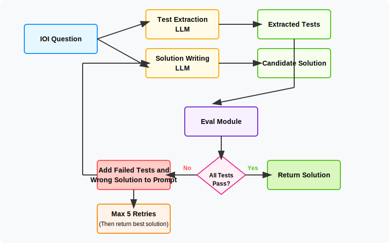

Important notes: 

- I had to modify the outputs of problem [234B](https://codeforces.com/problemset/problem/234/B) test because the expected outputs in the original files were all "File not found." I'm guessing a problem with the extraction code. I included the tests from the example, so I guess this problem counts as "free" because the solutions are included in the example. 

### checkpoint 1 

architecture: 

<div align="center">
  
</div>

results: 

```
Total cost: $0.02
{
  "score": 0.4666666666666667,
  "total_questions": 30,
  "passed_count": 14
}
```

notes:
- experimented with increasing the number of retries - with no effect to results
- it could be useful to have context from previous runs, so model always knows what it's already tried? we currently only store n - 1 run in prompt 
- 

### checkpoint 2

architecture: 

same as above, just passing more context back on failed tests

notes: 

Noticed that sometimes LLMs were retrying and repeating previous mistakes. So, implemented a retry mechanism that tracks solution history across multiple attempts (up to 5), providing the LLM with context about all previous solutions and their specific test failures to avoid repeating mistakes.

results: 

```
Total cost: $0.05
{
  "score": 0.53...,
  "total_questions": 30,
  "passed_count": 16
}
```

- we're still spending only about 1.31 seconds per question, when the limit is 30.
  - tested with increasing the number of retries with no visible difference in results

### checkpoint 3

- next experiment: multi-solution approach (generate 2-3 different solution approaches and evaluate each)